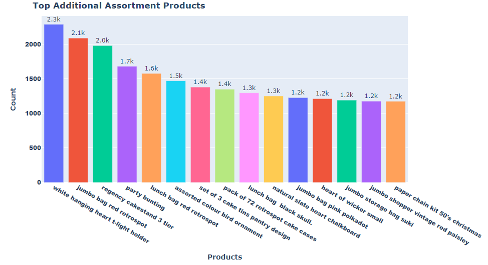

# Product Analysis Portfolio

   
 

## [Detailed Project Link](https://nbviewer.org/github/Emmanuel-Nti/product_range_analysis/blob/master/final_project_e_nti.ipynb) 

#### How I Approached the Project
- Importation of the data and libraries
- Preprocessed the data and carried out exploratory data analysis (categorized the products with machine learning algorithm)
- Analyzed the product range 
   - Revenue analyses
   - Products more often sold by themselves
   - Products in additional assortment
   - Product categories more often in additional assortment
   - Product categories often present in shopping carts
- Formulated and tested statistical hypotheses
- Conclusion and recommendations

#### Products in Additional Assortment
About 99% of the products were sold together with others.

   
 

 
#### General Findings
- The highest unit price of a product costed £38,970.00.
- Unit price had a mean on about £4.60.
- Invoice number 573585 had the highest number of products ordered (1113 products). The top ten invoices show the customers of the store are mostly wholesalers.
- Kitchen ware is the most frequently purchased category, plant and accessories are the least frequently purchased category.
- The highest daily orders was on November 30th 2018, followed by November 15th 2019 (141 and 136 orders respectively). The lowest daily order was on 4th February 2019 - just 11 orders.
- The number of total monthly orders from December 2018 to November 2019 increased by about 121%.
- Revenues are comparatively lower from January to July and higher from August to November.
- Regency cakestand 3 tier and paper craft little birdie are the top two products in terms of revenue generation. Regency cakestand 3 tier generated a revenue amounting to about £174,200.00 - the highest.
- The most cancelled product order is Regency cakestand 3 tier - cancelled 180 times.
- On average, paper craft little birdie generated the highest revenue - about £168,469.00.
- On average, Kitchen ware generated the least revenue - about £18 while home decorations generated the highest- about £23.
- There were 1501 products that were sold by themselves. Rabbit night light was sold alone 32 times- the most sold alone product.
- About 99.7% of the products were sold together with others - additional assortment.
- Jumbo bag and pink polkadot and jumbo bag red retrospot were the products most often sold together.
- White hanging heart t-light holder was the product sold the most with others - about 2300 times. Kitchen ware was most often included in additioanl assortment (about 152,610 times) and plant and accessories was the least - about 15,840 times.
- Event and party category was mostly present in shopping carts with Kitchen ware.
- The difference between average revenue from home decorations and Kitchen ware was statistically significant.
- The average revenue generated by paper craft little birdie is not statistically and significantly different from average revenue from all other products.

#### Recommendations
- Since about 99.7% of products are included in additional assortment, there is a need to create a product recommendation system.
- Home decorations is the third most purchased category but has the highest average revenue. Hence, invest more in advertising home decorations to boost purchase rate and revenue.
- As plant and accessories is the least frequently purchased category, increase advertising investment to enhance orders.
- Regency cakestand 3 tier is the leading revenue generator on aggragate but the most cancelled product order. Pay much attention to this product. For instance, why does it often get cancelled? If the cancellation rate is minimized, revenue would be maximized.

#### Software and Tools

  

  
